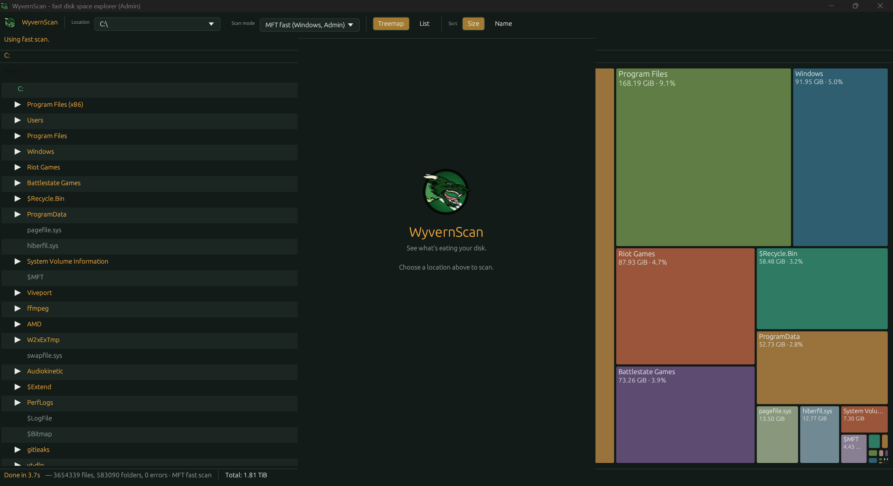
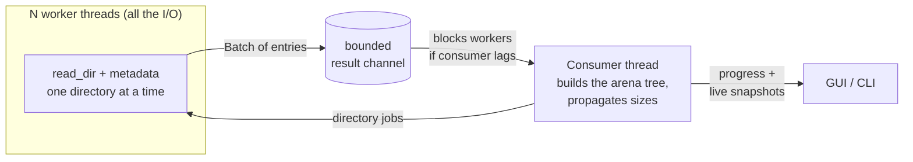
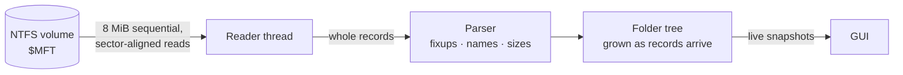

<div align="center">


# WyvernScan

**See what's eating your disk — fast.**

A TreeSize / WizTree-style disk space explorer written in Rust.
Scan a folder, a drive, or your entire system, then drill into an expandable
tree and a squarified treemap — and delete straight from either view.


[](https://deepwiki.com/dragon99z/wyvernscan)

</div>

<p align="center"></p>

---

## Features

| | |
|---|---|
| **Tree + treemap views** | A TreeSize-style expandable list *and* a squarified treemap. Both fill in **live while scanning** (normal and fast scan) — no static "Scanning…" spinner. |
| **Windows MFT fast scan** | Streams the NTFS Master File Table front to back in big sequential reads (the WizTree trick) and rebuilds the folder tree from it — no per-folder seeking, so it's fast on spinning disks too. Needs Administrator and a whole-drive scan; falls back to the normal scan automatically. |
| **Fast parallel normal scan** | Cross-platform walker with worker threads doing all the I/O and a bounded pipeline, so memory stays flat no matter how big the drive is. |
| **Real progress** | Bytes scanned vs. a true total for whole-drive scans (asked of the OS instantly — not a directory walk), plus a running timer and a **Cancel** button that keeps whatever was found. |
| **Location picker** | Browse, type a custom or network path, pick a detected drive/volume, scan **Entire System** (every drive merged into one tree), or jump back to your last 3 folders. |
| **Headless `--cli` mode** | Text or JSON reports for servers and scripts with no display. |
| **Admin-aware (Windows)** | Shows `(Admin)` in the title when elevated, with a one-click *Restart as Admin* otherwise. |
| **Delete from either view** | With a confirmation prompt. |

## Quick start

```bash
git clone https://github.com/dragon99z/wyvernscan.git
cd wyvernscan
cargo run --release
```

Requires a current Rust toolchain — grab one from [rustup.rs](https://rustup.rs).
The first build takes a few minutes (it compiles the GUI toolkit); rebuilds are fast.
The binary lands at `target/release/wyvernscan` (`wyvernscan.exe` on Windows).

## Building for Linux and macOS

WyvernScan is plain Rust, so each platform's build is the same `cargo build --release`, run **on that
platform** (cross-compiling a GUI app from Windows is not practical; use WSL2, a VM, a Mac, or CI).

**From Windows, the easy way is CI.** `.github/workflows/build.yml` builds and tests Windows, Linux and
macOS (one universal binary for Apple Silicon and Intel) on GitHub's own runners. Push the repository
to GitHub, open the **Actions** tab, pick the latest run and download the binaries from **Artifacts**.
Pushing a tag such as `v0.1.0` also publishes them as a GitHub Release. macOS in particular can only
be built on a Mac (Apple's SDK is not available elsewhere), which is exactly what the CI runner is.

<details>
<summary><b>Linux</b></summary>

```bash
curl --proto '=https' --tlsv1.2 -sSf https://sh.rustup.rs | sh   # Rust toolchain
sudo apt install build-essential        # C linker (Debian / Ubuntu); Fedora: sudo dnf install gcc
cargo build --release
./target/release/wyvernscan
```

- **Nothing GUI-related is needed to build.** The windowing (X11 and Wayland) and OpenGL libraries are
  loaded at runtime, so any normal desktop install already has what the GUI needs.
- **The folder picker uses the XDG desktop portal** (`xdg-desktop-portal` plus a backend such as
  `-gnome`, `-kde` or `-gtk`). Full desktops ship this; a bare window manager may not, in which case the
  picker will not open. You can still scan from the command line (`--cli`), or switch the dialog to GTK3
  by changing the `rfd` line in `Cargo.toml` to
  `rfd = { version = "0.14", default-features = false, features = ["gtk3"] }` and installing
  `libgtk-3-dev pkg-config` (`gtk3-devel` on Fedora).
- On Windows you can build the Linux version inside WSL2 with the same commands.
</details>

<details>
<summary><b>macOS</b></summary>

```bash
xcode-select --install                  # compiler and linker
curl --proto '=https' --tlsv1.2 -sSf https://sh.rustup.rs | sh
cargo build --release
./target/release/wyvernscan
```

Nothing else is needed: dialogs are native. To build one binary that runs on both Apple Silicon and
Intel Macs:

```bash
rustup target add aarch64-apple-darwin x86_64-apple-darwin
cargo build --release --target aarch64-apple-darwin
cargo build --release --target x86_64-apple-darwin
lipo -create -output wyvernscan \
  target/aarch64-apple-darwin/release/wyvernscan target/x86_64-apple-darwin/release/wyvernscan
```

The binary runs fine from a terminal. A double-clickable `.app` with a Dock icon needs the binary
wrapped in an app bundle (for example with `cargo-bundle`); that is not set up in this repository.
</details>

## Console mode (servers / no display)

```bash
wyvernscan --cli <path>              # scan a folder or drive, print a text report
wyvernscan --cli --entire-system     # scan every detected drive, merged
wyvernscan --cli C:\ --json          # machine-readable JSON report
wyvernscan --cli /var/log --full     # ignore the --top / --depth limits
wyvernscan --cli / --exclude /mnt/c  # WSL: keep the Windows drive out of the scan
wyvernscan --cli --help              # full option list
```

| Option | Meaning |
|---|---|
| `--entire-system` | Scan every detected local drive/volume, merged into one report |
| `--mode <auto\|normal\|mft>` | Scan strategy (`mft` is Windows-only, needs Admin, whole-drive roots only) |
| `--exclude <paths>` | Don't read these folders (shown as empty 0 B entries). Repeat the option, or separate several paths like `PATH` (`:` on Unix, `;` on Windows). Roots inside an excluded folder are dropped from `--entire-system`. Disables the Windows MFT fast scan |
| `--top <N>` / `--depth <N>` | Limit entries per level (default 20) / levels deep (default 3) |
| `--full` | Print everything |
| `--json` | JSON instead of text |
| `--no-banner` | Skip the ASCII-art banner (it is only printed when stderr is a terminal anyway) |
| `--debug` | Log full detail to **stderr** and `wyvernscan-debug.log` (system info, scan decisions, progress every 2 s, every unreadable path, result summary). stdout stays clean, so `--json` is still valid |

Progress goes to **stderr** and the report to **stdout**, so it pipes cleanly:
`wyvernscan --cli C:\ --json > report.json`.
Exit codes: `0` success · `1` scan failed outright · `2` bad argument.

On a terminal, console mode opens with an ASCII-art WyvernScan banner on **stderr** (so it
never pollutes the report). It is plain 7-bit ASCII, so it renders on any console, and it is
colored only where ANSI colors are known to work (`NO_COLOR` is respected). It is skipped
automatically when stderr is redirected, e.g. in cron jobs or CI logs.

**On Windows**, `wyvernscan.exe` is a GUI-subsystem program (so the GUI opens with no console window
behind it). In console mode it attaches to the terminal you ran it from, so output appears normally,
and if there is no terminal (for example from the Run dialog) it opens a console window and waits for
Enter before closing. One consequence of being a single exe: `cmd` and PowerShell do not wait for a
GUI-subsystem program, so the prompt comes straight back and the exit code is not reported. When a
script needs to wait for it or read the exit code, use `start /wait wyvernscan.exe --cli C:\` in `cmd`.

## How the normal scan works



- **Workers do every syscall**; the consumer only touches memory.
- **The channel is bounded**, so workers pause when the consumer falls behind — memory
  tracks the size of the tree, not how far ahead the readers got.
- **Live snapshots are skipped** while the UI hasn't picked up the previous message
  (e.g. a minimized window), so full-tree copies can never pile up.
- The tree is a flat arena (`Vec<Node>`) linked by index, with names stored as `Arc<str>`
  so snapshots are cheap to clone.

## How the fast scan works (Windows, NTFS)



Every file and folder on an NTFS drive has a record in the `$MFT`, and each record
says which folder it lives in. So instead of asking the OS to list folders one by one
(each a separate disk read), WyvernScan reads the table once, in order, and links the
records together in memory. The record format is parsed directly — no NTFS library.

- A reader thread keeps the disk streaming while another thread parses; the volume is
  read with unbuffered direct I/O (falling back to buffered if the driver refuses), so
  fast drives are read at close to their real sequential speed.
- Only the in-use parts of the table are read: the `$MFT` never shrinks, so a drive
  that once held a huge, now-deleted tree (a removed `venv` or `node_modules`) carries
  gigabytes of dead records that the scan skips using NTFS's own bitmap.
- The tree grows as records arrive (a file waits briefly if its folder's record
  hasn't been read yet), so the live view works here too.
- Heavily fragmented `$MFT`s (the norm on an old, busy system drive) are followed
  through their attribute list.
- Anything unexpected (not NTFS, an unusual layout, an I/O error) falls back to the
  normal scan instead of guessing.

## Debugging

Launch with `--debug` (with or without `--cli`) for a real console window on Windows and a
`wyvernscan-debug.log` on every platform (next to the executable, or in the temp directory if
that folder isn't writable), with full detail — including exact panic messages —
for anything the UI only reports in a short, simplified form. It also logs every item
behind the "N errors" count — the exact path and the OS error for each folder or file
that couldn't be read (capped at 2,000 lines per scan, so a failing drive can't flood it).
The fast scan also logs a timing breakdown (time reading vs. waiting on the disk vs.
parsing), which makes "why was this scan slow?" answerable from the log.

With `--cli`, debug lines go to **stderr**, never stdout, so
`wyvernscan --cli / --json --debug > report.json` still produces valid JSON. The log opens with
system info (version, OS, WSL/container, user id, CPU count, arguments) and then records the
scan decisions (which strategy, which virtual filesystems were skipped), a progress line every
2 seconds, any single file over 1 TiB, and a result summary with the five largest entries and
the chain of largest folders down to the biggest file. If the scanned total exceeds the used
space of the volume, it says so, which pinpoints sparse/virtual files.

If a scan pauses for several seconds, look for `slow read` lines in that log. They name
the exact spot on the disk that responded slowly. That is the drive, not WyvernScan: an
ageing SSD can read old, untouched data far slower than new data. WyvernScan shows
"Waiting on the drive…" in the status bar while it happens. It is worth checking the
drive's SMART health (for example with CrystalDiskInfo) and keeping a backup.

## Tests

```bash
cargo test --release
```

The fast-scan tests run against a synthetic NTFS volume built in memory (hard links,
extension records, torn records, reads that straddle record boundaries, a device that
rejects unaligned I/O, and a garbage-input fuzz loop), on every platform.

One slower test isn't run by default — a memory-scaling check against a synthetic
100,000-file tree:

```bash
cargo test --release scan_memory_stays_bounded_on_large_tree -- --ignored --nocapture
```

## Look and feel

WyvernScan's identity is a wyvern's hide read through a diagnostic instrument:

- **Surfaces** are deep, near-black greens; the only accent is the amber of a wyvern's eye
  (a complement to the greens of the icon and the treemap), used for state rather than decoration.
- **The treemap** uses a muted palette of hide, bronze, ember and wing-membrane tones on flat tiles,
  so a folder's color reads as a label rather than noise.
- **The icon** is a minimal badge in the style of the original dragon99z logo: a black ring, a green
  field and three white stripes that slide out from behind the dragon's head. The horns and snout
  break out past the ring. The dragon artwork is `assets/dragon_head.png`.

The icon is composited from `assets/icon_base.svg` (ring and field), `assets/icon_stripes.svg` and
`assets/dragon_head.png` (the artwork). To regenerate every derived file
(`icon.ico`, `icon-512.png`, and the raw-RGBA files the app embeds):

```bash
pip install cairosvg pillow numpy scipy
python3 assets/make_icon.py
```

The generated files are committed, so a normal build needs neither Python nor those packages.
On Windows, `build.rs` embeds `assets/icon.ico` into the `.exe`; if the Windows resource
compiler isn't available the build still succeeds, just without the exe icon.

## Known limitations

- **Linux:** virtual filesystems (`/proc`, `/sys`, `/dev`, cgroups, ...) are never read; they show
  as empty 0 B folders. Previously `/proc/kcore`, which claims to be 128 TiB, inflated every scan
  of `/`. `tmpfs` is still scanned. Other mounts below the target (for example `/mnt/c` in WSL)
  are still included; leave them out with `--exclude /mnt/c` (in `--entire-system` this also
  removes it as a separate root, so it isn't counted twice).

- The MFT fast scan only triggers on a whole drive root (`C:\`), never a subfolder.
- The drive/volume list is captured once at startup; a drive plugged in mid-session
  appears after a restart.
- Sizes are **logical** size, not on-disk allocated size — they differ for sparse,
  compressed, or hard-linked files.
- The whole-drive progress bar compares against the OS's reported "used space", which
  includes filesystem overhead, so it usually finishes a little short of 100%.
- The MFT fast scan hands off to the normal scan for unusual NTFS layouts rather than
  guessing.

## For AI coding agents

See [`AGENTS.md`](AGENTS.md) (and [`CLAUDE.md`](CLAUDE.md), which points to it) for the
module map, the design decisions that already fixed real bugs once and shouldn't be
casually reversed, and the constraints of developing this cross-platform project without
a Windows machine.
